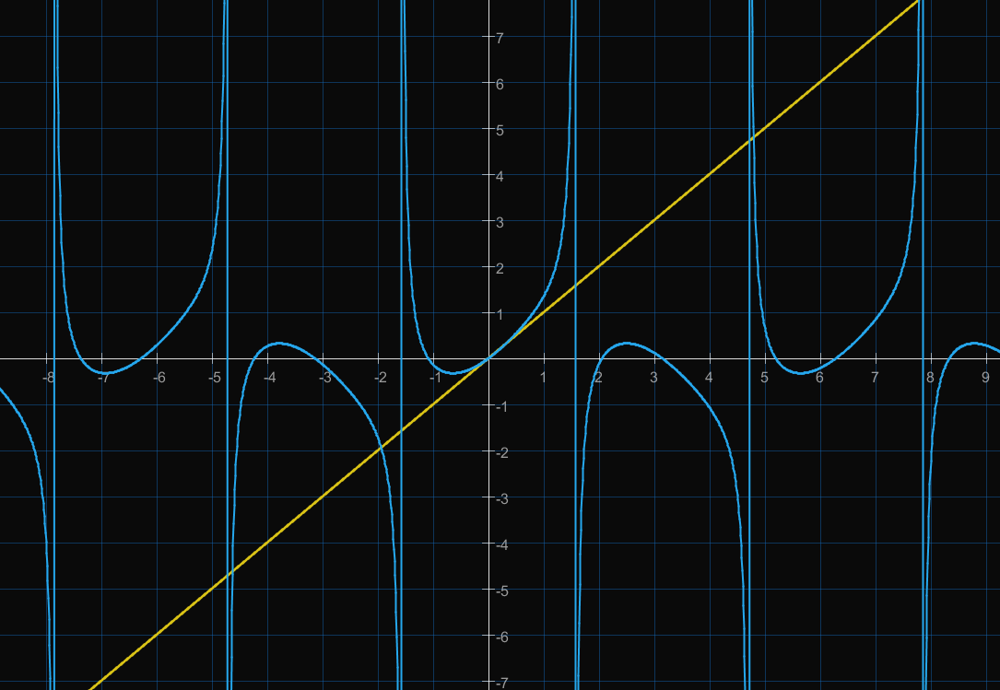
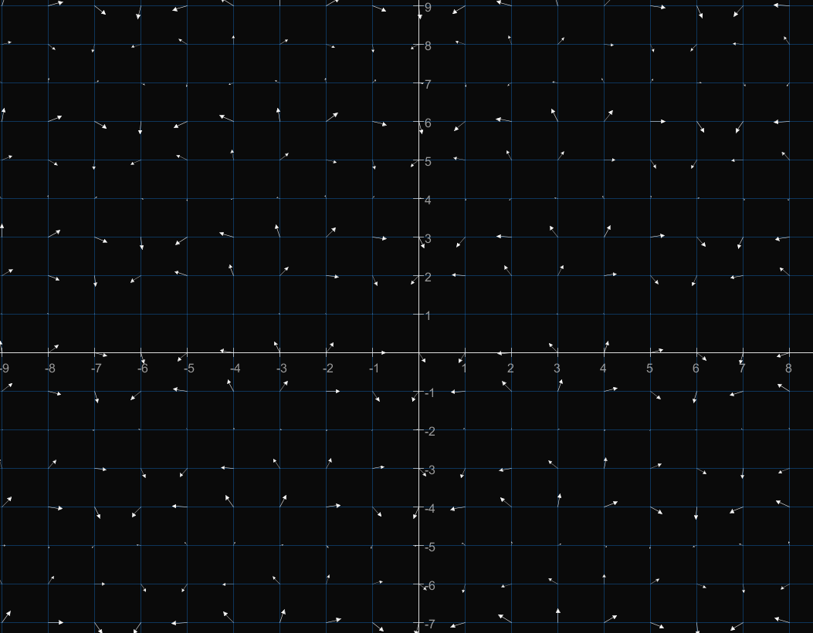

# MathAnimation
## Description
A Java code that allow Math Animation inspired by 'manim' Python library. 
You can draw functions, points and animate them based on time. 
Then, you can export your graph animation on a mp4 file simply by pressing a few buttons. 
Basically, you can create a simple 2D Plot with infinite functions and points number and animate them based on keyframes.
 

## Functionnalities
This code is non-profit and under developpement. Once launched, press 's' to start recording and 'q' to stop. 
MathAnimation was developped using the Processing language and the ffmpeg library. 
Please be free to post suggestions about improvement or implementations.
 

## Screen Examples

